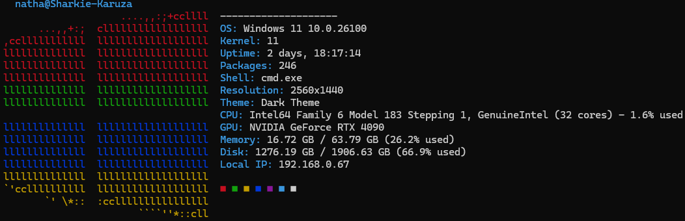

# WinStats

A sleek Windows system information display tool inspired by Neofetch, written in Python.

## 📝 Description

WinStats provides a visually appealing way to display your Windows system information in the terminal. It shows essential system details alongside a colorful Windows logo rendered in ASCII art.

## ✨ Features

- Displays OS version, hostname, and kernel version
- Shows system uptime
- Counts installed packages
- Detects current shell
- Reports screen resolution
- Identifies current theme (light or dark)
- Shows CPU and GPU information
- Displays RAM and disk usage
- Shows local IP address
- Features the classic Windows logo in traditional colors

## 🔧 Requirements

- Python 3.6+
- Required libraries:
  - psutil
  - colorama

## 📦 Installation

```bash
# Clone the repository
git clone https://github.com/NathanPoultney/WinStats.git
cd WinStats

# Install required packages
pip install -r requirements.txt
```

## 🚀 Usage

Simply run the Python script:

```bash
python winstats.py
```

## 📸 Screenshot



## 🔨 Dependencies

Create a `requirements.txt` file with:

```
psutil>=5.9.0
colorama>=0.4.4
```

## 📄 License

MIT License - see LICENSE file for details.

## 🤝 Contributing

Contributions, issues, and feature requests are welcome!

## 🙏 Acknowledgements

- Inspired by [Neofetch](https://github.com/dylanaraps/neofetch)